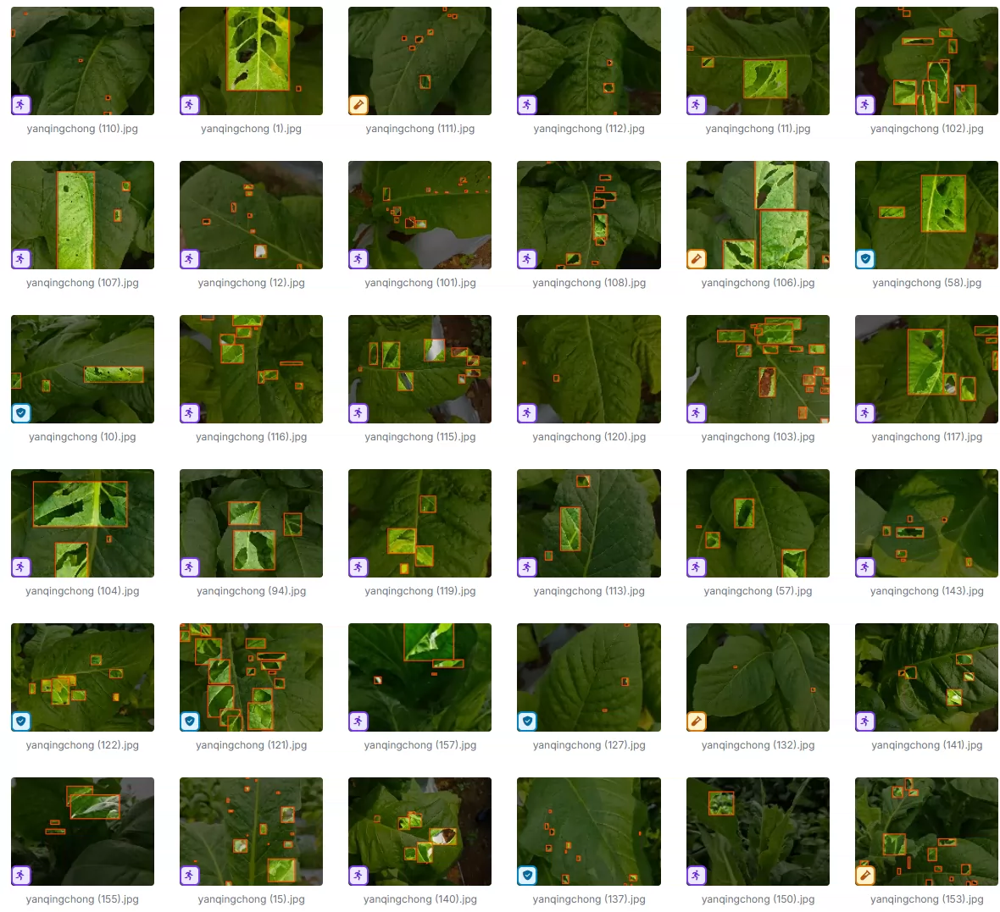
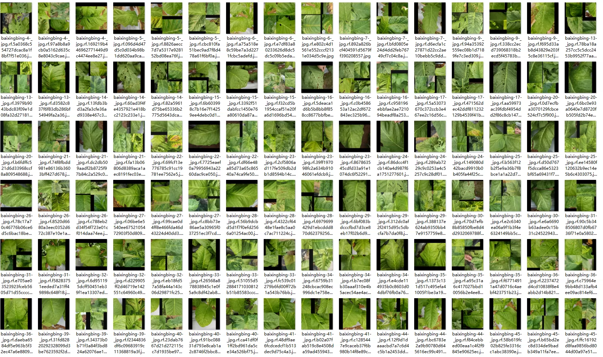
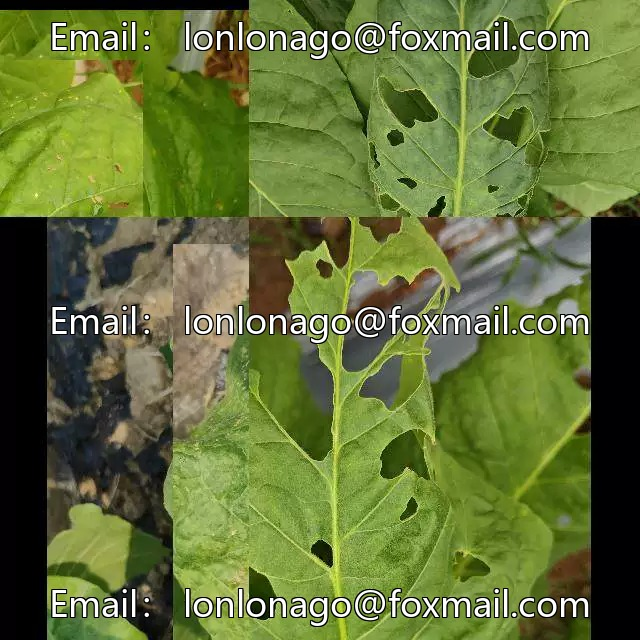
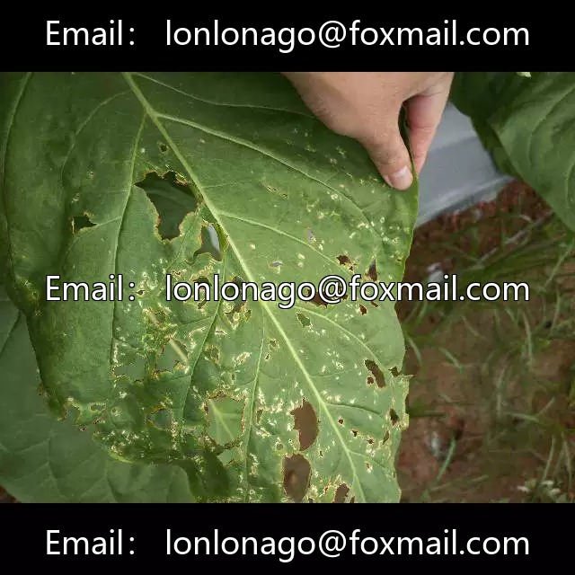
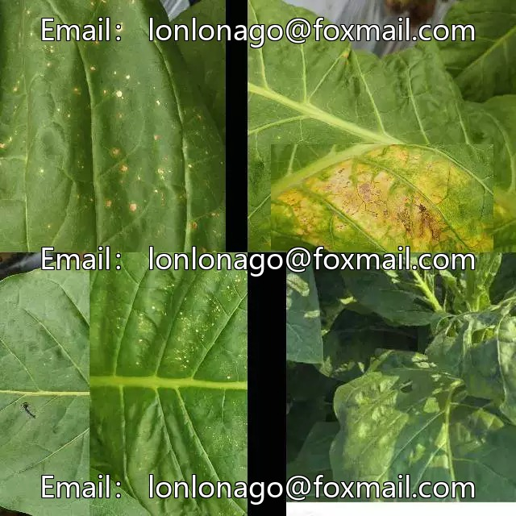
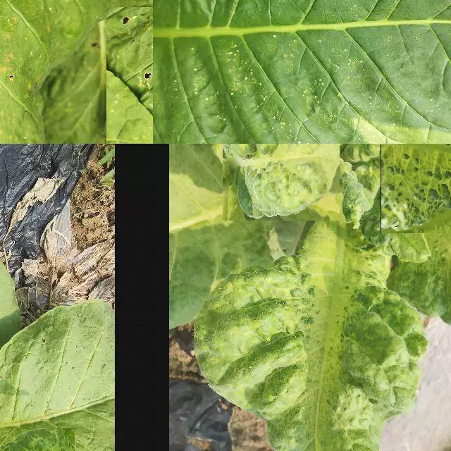
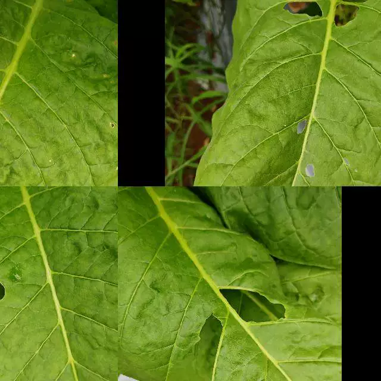

## Body

(Agricultural Products) Tobacco Disease Target Detection Dataset

Totally 2k images, each labeled with YOLO format, divided into training set, test set, validation set.
It is divided into 4 categories, namely 'baixingbing', 'huangguahuayebing', 'yanqingchong', 'yehuobing'.
'baixingbing' (White Powdery Mildew), 'huangguahuayebing', 'yanqingchong', 'yehuobing'.

Electronic virtual products sold are not returnable.

## Images

Here is a pay link on Stripe ( https://buy.stripe.com/3cs8yP7sY87d0vu9AB ). Please contact me lonlonago@foxmail.com after funding $89, and I will send you a complete data files , thank you!

